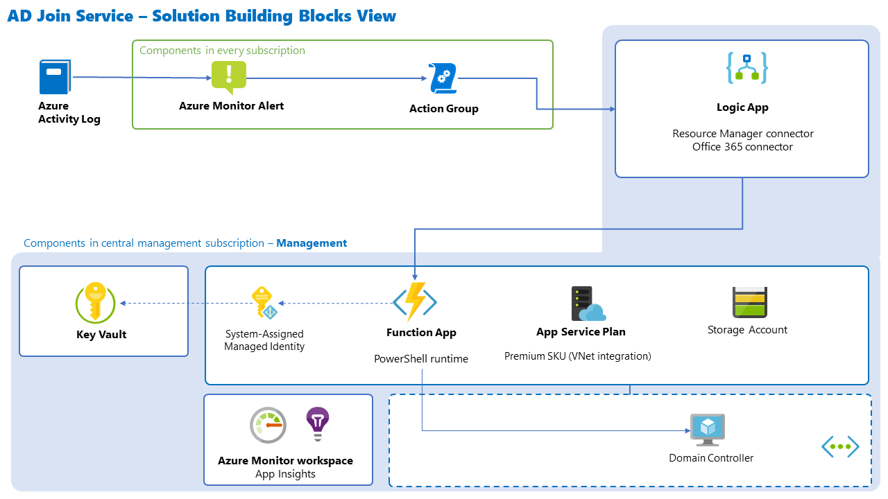
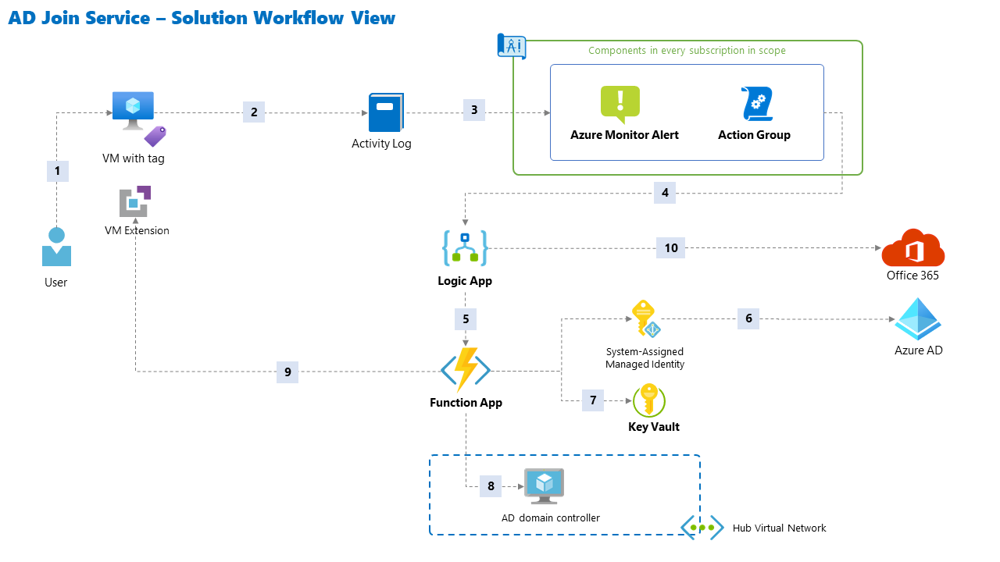

# AD Domain Join Service Design

## Prerequisites

### Customer environment

- **Connectivity to domain:** there needs to a connectivity in place between a "Virtual Machine VNet" and "AD Domain VNet" (a VNet hosting domain controllers or enabling connectivity to domain controllers hosted on-premises).
- **DNS configuration:** Virtual Machine VNet (subnet) needs to be configured to use DNS servers to be able to resolve records required for communication with Active Directory and domain join process.

### Domain Join service

- **Authorization to domain join:** the automation code will refer to an Azure Key Vault secret containing a password of a domain user account that is authorized to perform the Domain Join operation. The Key Vault has an access policy to allow 'Managed Identity' to read secrets, and it also permits ARM to access the Key Vault secret.
- **Authorization to modify resource:** the service / its identity must be able to deploy a Domain Join VM Extension for VMs in customers` subscriptions.

## Solution building blocks

## Solution workflow

1. A user provisions a Virtual Machine with a tag (`domainJoin`: `yes`).
2. A new `Create or Update Virtual Machine` event is written to the Activity Log.
3. Azure Monitor alert captures this event and executes a set of actions defined in a linked Action Group.
4. The Action Group calls a Logic App (using a webhook).
5. The Logic App executes its workflow: it validates presence of the required tag, and if true, it calls an Azure Function using a HTTP trigger (webhook) with a JSON payload containing details about the VM (VM name, RG, subscriptionId).
6. The Function App uses its Managed Identity to authenticate against Azure AD and obtain an access token.
7. The Function uses the token to access Azure Key Vault and retrieve a secret (a password for a service account in Active Directory that has permissions to domain join machines).
8. The Function validates the request (checks all prerequisites for a successful domain join as well as the OS type) and queries an Active Directory domain controller to verify, if the VM name (Computer object) already exists in the database or not.
9. If the request passes all validations, it executes a deployment of a VM Extension (a Microsoft-provided domain join extension), while injecting some properties (like credentials for the operation, the domain and OU names, etc.).
10. Depending on the result of steps 8 and 9, the Logic App sends either a message to the user (about successful completion) or an alert to the PlatformOps team.

## Solution description

### Opt-in self-service based on event-driven automation [R01, R02, R19]

The service utilizes **resource tags** as the opt-in mechanism, allowing customers to chose, what specific VMs should be domain joined. Tags are an integral part of  Azure Resource Manager experience, it does not implement a new interface for users, it can be implemented as code (Resource Manager templates, Terraform modules, CLI or PowerShell scripts), and from the access control perspective, it does not require any additional permissions _(apart from assumed VM ownership / rights)_. VM owner needs to apply a specific tag key and value (`domainJoin:yes`) on the Virtual Machine resource.

The service uses event-driven design pattern. Instead of polling resources for a state change, it subscribes to specific platform / control plane event - `Create or Update Virtual Machine` - that occur in subscriptions. Every subscription in scope is configured to "subscribe" for this specific event type. This is done in form of **Azure Monitor alert** [rule](https://docs.microsoft.com/en-us/azure/azure-monitor/platform/alerts-activity-log) which is linked to an **Action Group** (also pre-created). The Action Group is configured to trigger an [action](https://docs.microsoft.com/en-us/azure/azure-monitor/platform/action-groups-logic-app) - calls a Logic App via webhook (deployed in `Management subscription`) and executes its workflow. The workflow runs in the background and it will either perform a successful domain join operation, or it will notify the PlatformOps team about a any issue (e.g. failed validation).

The **Logic App** reads the alert message payload, and validates the conditions - presence of domainJoin tag and its value by calling ARM REST API. In case of a match, it calls the Function App, passing in important parameters (subscription Id, resource group name, VM name). After the function run is completed, the Logic App checks the result (parses the JSON output from the execution) and it sends an e-mail (using O365 connector) with the result. There are three possible outcomes:

- DomainJoin succeeds - e-mail is sent to the requestor with this info
- DomainJoin fails - naming conflict - e-mail with explanation is sent to the user
- DomainJoin fails - validation checks - e-mail is sent both to the user and to the PlatformOps mailbox

The core logic is in an **Azure Function App** provisioned in the central Management subscription together with a Premium App Service plan and a storage account (required by Function Apps to host function code, configuration, etc.). The Function App is deployed with [PowerShell](https://docs.microsoft.com/en-us/azure/azure-functions/functions-reference-powershell) as the runtime environment.

The function is designed to use [HTTP trigger](https://docs.microsoft.com/en-us/azure/azure-functions/functions-reference-powershell#http-triggers-and-bindings) and it has these properties:

- validation: validating all prerequisites via ARM API
- domain check: checking hostname uniqueness against AD domain
- domain join: adding a VM Extension for Domain Join via ARM. The extension will connect to a defined domain, perform a domain join, and reboot the VM. The code will use 'hostname' property of the Virtual Machine, rather than 'resource name'
- logging: sending function streams/output to Application Insights [workspace](https://docs.microsoft.com/en-us/azure/azure-functions/functions-reference-powershell#logging)
- after completing the operations, use a [HTTP response](https://docs.microsoft.com/en-us/azure/azure-functions/functions-reference-powershell#push-outputbinding-example-http-responses) to talk back to the Logic App

The function code will be written using PowerShell functions that would either be stored within the `run.ps1` main code file or moved to a custom PowerShell module that would be referenced from that script.

### Integration with Active Directory domain and hostname uniqueness validation [R03, R08]

Many landing zones in Azure do not enforce any strict naming convention for resources that would guarantee hostname uniqueness (for Azure Virtual Machines). This is an important requirement for AD domain join, so the service must validate **name uniqueness** (check, whether that Computer object exist already in the database) before it attempts to join a new VM to the domain.

This functionality depends on several capabilities:

- connectivity between the function's execution environment and the AD domain - the Function App is configured with **VNet Integration**, a [feature](https://docs.microsoft.com/en-us/azure/app-service/web-sites-integrate-with-vnet) allowing function apps to connect privately to a VNet. This VNet is peered to a Hub VNet, hosting domain controllers that could be queried.
- credentials allowing the function to query Active Directory - the automation code queries a Key Vault (hosted in the Management subscription) for a secret containing a domain account password. This credential corresponds to a domain user account that is authorized to perform the Domain Join operation (in a specific OU).
- PowerShell implicit remoting - since it is not possible to import `activedirectory` PowerShell module to the Function App, the function code will use [implicit remoting](https://4sysops.com/archives/using-powershell-implicit-remoting/), a feature that allows you to create a new session, import the necessary modules in that session, and then export the commands available in that session locally.
- Function App's DNS settings - after the app integrates with a VNet, it uses the same DNS server that the VNet is configured with.

### Virtual Machine operating system check [R04]

The function code will perform several checks, ensuring all pre-requisites are met for a successful domain join operation. This includes checking VM's operating systems. This can be done by checking the `StorageProfile.osDisk.OsType` property of the VM object. Any other OS will be excluded and the code will exit with `DomainJoin fails` message.

### Prevent racing condition [R05]

- [R05] prevent racing condition (several events coming from the same VM, triggering the automation multiple times)

### Automated dependency management [R06]

Functions code is typically dependent on external libraries that must be imported to the runtime environment and maintained (updated). Azure PowerShell Functions come with a **dependency management** [feature](https://docs.microsoft.com/en-us/azure/azure-functions/functions-reference-powershell#dependency-management) that allows developers to specify what modules are required, and that automatically imports and updates those modules from the PowerShell Gallery.

The service will use this feature to have access to all needed `Az` modules.

### Dynamic configuration [R07, R03]

Hard-coding configuration to the code has always been considered as a bad practice. The Function App will utilize **Application Settings** to store important configuration.

Examples are:

- [reference](https://docs.microsoft.com/en-us/azure/app-service/app-service-key-vault-references) to Key Vault secret,
- parameters for the VM Extension (like domain name, OU path, username),
- keyVaultId, etc.

These settings are made available for the function code in the form of [environment variables](https://docs.microsoft.com/en-us/azure/azure-functions/functions-reference-powershell#environment-variables).

### Service lifecycle management and deployment [R09]

A deployment pipeline will be used to provision all resources and its configuration (using ARM JSON templates) and deploy Function code (PowerShell). The pipeline will also assign required permissions (both in RBAC as well as Key Vault access policy) for the Managed Identity.

Build stage outline:

- validate / test Resource Manager templates with ARM TTK and show test results
- unit testing of PowerShell function code (Pester, utilize mocking) and show test results

Release stage outline:

- resource deployment (`New-AzResourceGroupDeployment`)
- role assignment for the Managed Identity (if not done already)
- Key Vault access policy update
- Function code deployment
- Domain Join E2E test (only in QA environment ??)

Release stage environments:

- QA environment
- Prod - using Management subscription

### Manage lifecycle of domain records to reflect VM lifecycle [R10, R12]

Previous version of the service is only supporting "join" operation, but it does not handle scenario, when a VM is deleted from the environment. The new version handles that scenario in the following way:

- after a successful VM Extension deployment, the VM `domainJoin` tag is changed from `yes` to `done`. In this way, we:
  - prevent triggering the entire workflow after every "Create or Update VM" event. The processing will be stopped in the Logic App.
  - handle a redeployment scenario, when a VM doesn't need to be joined to the domain again (its membership is still valid), so it will not produce 'false positives'

### Automated testing [R11]

The service will be deployed to several environments (based on its lifecycle), and eventually to Production, using a CI/CD pipeline. It is imperative to include testing of all code artifacts in the pipeline and related process. The topic is therefore tightly coupled with "Service lifecycle management and deployment" section.

There are two main code artifacts for testing:

- resource manager template(s)
- function code (PowerShell)

Automated testing is added in various stages of the pipeline:

- unit tests of the function code - using [Pester](https://pester.dev/) - part of build process
- integration test of the function code - using Pester - part of deployment process to QA environment
- testing of resource manager template(s) - using [ARM TTK](https://docs.microsoft.com/en-us/azure/azure-resource-manager/templates/test-toolkit) - part of deployment process to QA environment

### Identity, authentication, authorization [R13]

**Managed Identity** is a security principal that is [used by Azure Functions](https://docs.microsoft.com/en-us/azure/app-service/overview-managed-identity?tabs=dotnet) to call Azure AD-integrated APIs (e.g. ARM REST API, Key Vault API), and perform needed operations.
The service will use 'System Assigned Managed Identity' that will follow the function app throughout its lifecycle.

### Secrets management [R14]

All secrets required by the service will be stored in an **Azure Key Vault** instance (hosted in the Management subscription). It will primarily contain credentials for AD domain join operation (function key from Active Directory).

The Key Vault will be configured by using [Access policies](https://docs.microsoft.com/en-us/azure/key-vault/general/secure-your-key-vault) to:

- allow Function App's Managed Identity to read secrets
- allow Resource Manager to access secrets

### Monitoring and reporting [R15, R16, R17, R18]

The following functionality will be implemented in this release:

- Logic App will be extended with steps checking the result of Function run and based on returned code, it will either:
  - send a message to the user triggering the original 'Create or Update Virtual Machine' operation about a successful Domain Join or a naming conflict (aka Customer Notification)
  - send a message to PlatformOps about a failed execution with a code indicating what part of the function code failed
- Both Azure Function and Logic App components will send application telemetry or diagnostics logs to a central Azure Monitor workspace (in the Management subscription)
- A new Azure Dashboard (and/or a Workbook) will be created based on logs from key components (aka Operational Reporting)
- A collection of Alert Rules will be created in Azure Monitor, capturing failed events in key components (Logic App, Function App) and sending notifications to one of the PlatformOps channels (to be defined)
